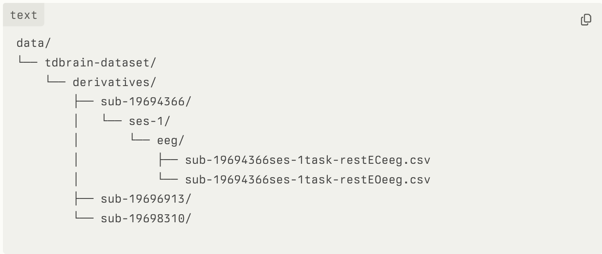

# EEG Graph Learning

Graph-based machine learning for EEG data analysis using self-supervised learning approaches.

## Project Overview

This repository contains the implementation of graph-based machine learning models for self-supervised pre-training on EEG data. The goal is to develop robust representations of EEG signals that can be used for downstream tasks such as psychiatric condition classification.

## Installation

### Clone the repository
`git clone https://github.com/yourusername/eeg-graph-learning.git `  \

`cd eeg-graph-learning`

###  Create and activate the conda environment
`conda env create -f environment.yml` \
`conda activate eeg-graph-learning`

Install the package in development mode \
`pip install -e .`

## Project Structure

The repository is organized as follows:

- `clean.sh`: Shell script to automate the preprocessing pipeline execution
- `environment.yml`: Conda environment configuration
- `eeglearn/`: Main package containing all the code
  - `preprocess/`: EEG preprocessing modules
  - `models/`: Graph neural network models
  - `dataloader/`: Data loading utilities
  - `features/`: Feature extraction modules
  - `pretext/`: Self-supervised learning tasks
  - `downstream/`: Downstream task implementations
  - `utils/`: Utility functions
- `data/`: Directory for storing datasets (not included in the repository)
- `tests/`: Unit tests
- `notebooks/`: Jupyter notebooks for exploration and visualization
- `experiments/`: Experiment configurations and results
- `scripts/`: Utility scripts

## Data Setup

This project uses the TD-Brain dataset, which requires a Data Usage Agreement (DUA).

1. Apply for access to the TD-Brain dataset : https://www.brainclinics.com/resources/tdbrain-dataset
2. Once approved, download the dataset. You may use the sample dataset  (~7Gb) or the full dataset (~100 gb) with this code.
3. Add the files into the `data` directory following the structure below:



4. Place the participant metadata file in the following location:
   ```
   data/TDBRAIN_participants_V2.xlsx
   ```
   This file contains important metadata about participants and is used for various analyses.

5. You can run the preprocessing pipeline in two ways:

   a. Using the clean.sh script (recommended):
      
      **For macOS/Linux:**
      ```bash
      # Make the script executable (if not already)
      chmod +x clean.sh
      
      # Run the preprocessing script
      ./clean.sh
      ```
      
      **For Windows:**
      
      Option 1 - Using Git Bash or WSL (Windows Subsystem for Linux):
      ```bash
      # Make the script executable (if not already)
      chmod +x clean.sh
      
      # Run the preprocessing script
      ./clean.sh
      ```
      
      Option 2 - Using Command Prompt or PowerShell:
      ```
      # Install Git Bash or WSL first, then follow the instructions above
      # Alternatively, you can run the Python script directly:
      conda activate eeg-graph-learning
      python -m eeglearn.preprocess.preprocess_pipeline
      ```
      
      The script will automatically:
      - Detect your operating system
      - Check if the conda environment exists and create it if needed
      - Activate the conda environment
      - Run the preprocessing pipeline
      
      The script is designed to minimize verbose output, showing only essential progress information.
      If you need to debug issues, you can edit the script and uncomment the `set -x` line to enable command echoing.
   
   b. Manually:
      - Navigate to `eeglearn/preprocess`
      - Run `python preprocess_pipeline.py`

   Parameters like sampling frequency, epoch length, and line noise removal can be configured in the `preprocess_pipeline.py` file.

## Testing

### Test Configuration

The test suite can use either synthetic data (generated automatically) or your own EEG data files for testing. By default, it will create synthetic test data, but you can configure it to use your own EEG data files.

#### Using Custom Test Data

To use your own EEG data file for testing, set the `EEG_TEST_FILE_PATH` environment variable to the path of your test file:

Place a cleaned .npy file here : 

tests/test_data/data/cleaned/{subject_id}/ses-1/eeg/your_file


Place a csv file here: 

tests/test_data/TDBRAIN-dataset/derivatives/{subject_id}/ses-1/eeg/your_file

```bash
# Bash/Zsh
export EEG_TEST_FILE_PATH="/path/to/your/eeg/test/file.csv"

# This is should be the result of running the
# clean_pipeline function in preprocess_pipeline.
export EEG_CLEANED_TEST_FILE ="/path/to/your/eeg/test/file.npy"

export EEG_TEST_CLEANED_FOLDER_PATH ="/path/to/cleaned/
```

The test file should be a CSV file with the following characteristics:
- Channels as columns
- Time points as rows
- 33 channels (26 EEG + 7 other)
- Sampling frequency of 500 Hz

If `EEG_TEST_FILE_PATH` is not set or the file doesn't exist, the test suite will automatically generate synthetic test data.

#### Running Tests

To run the test suite:

```bash
# Run all tests
pytest

# Run specific test file
pytest tests/test_preprocessing.py

# Run tests with verbose output
pytest -v
```

## Troubleshooting

### Cross-Platform Issues

#### Windows-specific Issues

1. **Line Ending Problems**: If you encounter errors related to line endings when running the shell script on Windows, you may need to convert the line endings from CRLF to LF:
   ```bash
   # Using Git
   git config --global core.autocrlf false
   # Then re-clone the repository or run:
   dos2unix clean.sh
   ```

2. **Conda Activation Issues**: If conda activation fails in the script:
   - Ensure Anaconda/Miniconda is properly installed and added to your PATH
   - Try running the commands manually:
     ```
     conda activate eeg-graph-learning
     python -m eeglearn.preprocess.preprocess_pipeline
     ```

3. **WSL Recommendations**: For the best experience on Windows, we recommend using Windows Subsystem for Linux (WSL2) with Ubuntu, which provides a more Linux-like environment.

#### macOS-specific Issues

1. **Permission Issues**: If you encounter permission issues:
   ```bash
   chmod +x clean.sh
   ```

2. **Conda Command Not Found**: If conda is not recognized:
   - Ensure you've initialized conda in your shell:
     ```bash
     conda init zsh  # or bash, depending on your shell
     ```
   - Restart your terminal after initialization

#### Linux-specific Issues

1. **Missing Dependencies**: If you encounter missing system dependencies:
   ```bash
   # For Ubuntu/Debian
   sudo apt-get update
   sudo apt-get install -y build-essential
   
   # For CentOS/RHEL
   sudo yum groupinstall "Development Tools"
   ```

For any other issues, please open an issue on the GitHub repository.

### Enabling Verbose Output for Debugging

If you encounter issues with the preprocessing pipeline and need more detailed output for debugging:

1. Edit the `clean.sh` script and add the following line after `set -e`:
   ```bash
   # Enable command echoing for debugging
   set -x
   ```

2. Remove the redirection to `/dev/null` from the conda commands if you need to see conda's output:
   ```bash
   # Change this:
   eval "$(conda shell.bash hook)" > /dev/null 2>&1
   
   # To this:
   eval "$(conda shell.bash hook)"
   ```

3. Run the script again to see detailed output of each command execution.

